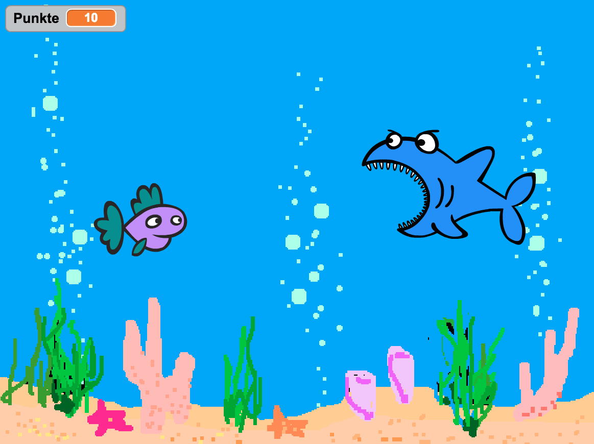
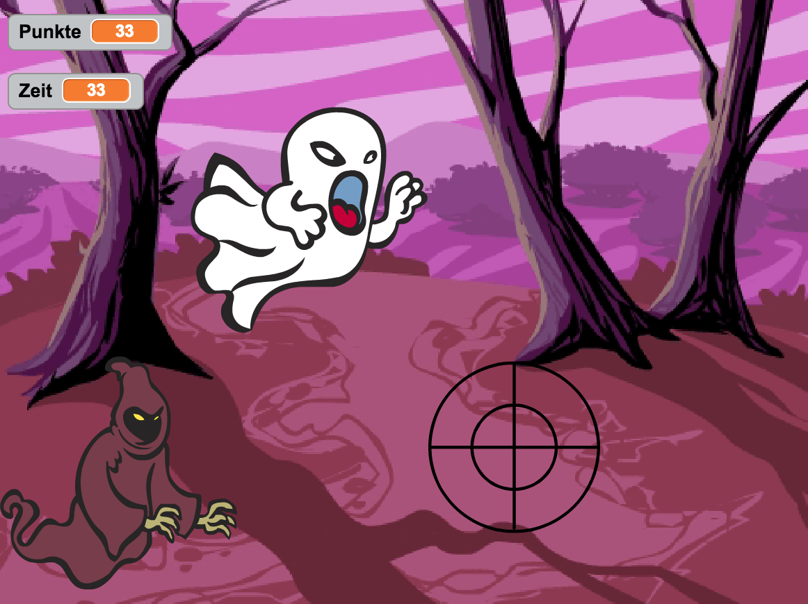
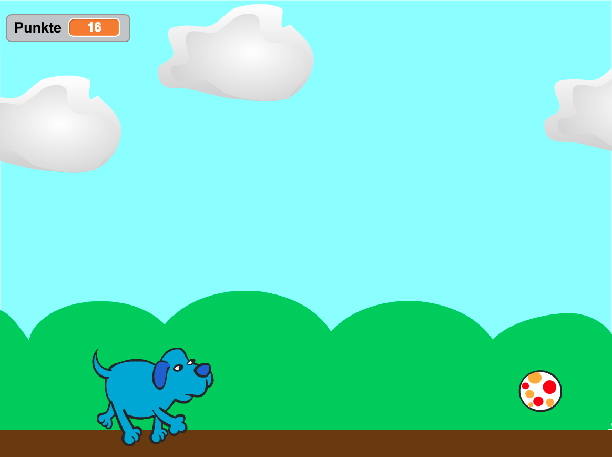

# Sushi-Cards für das CoderDojo

## Fischjagd

Ein einfaches Spiel, bei dem ein Hai mit der Tastatur gesteuert wird um kleine Fische zu fangen. Gut geeignet für Anfänger.

## Geisterjagd

Ein relative einfaches Spiel, bei dem man mit der Maus einen Geist fangen und dabei einem Gespenst ausweichen muß. Gut geeignet für Anfänger.

## Fang den Ball

Steuere einen Hund mit der Tastatur und fange Bälle. Etwas anspruchsvoller, aber nicht kompliziert.

## Bearbeiten

Die Karten wurden mit [Scribus](https://www.scribus.net/) erstellt und können damit auch bearbeitet werden. Dafür einfach die *.sla-Datei öffnen.
